# IecStringProject

IecStringProject is an Automation Studio project for developing, testing, and releasing the [IecString](https://github.com/tmatijevich/IecString) library.

# Performance Tests

```mermaid
gantt
    title 100 Calls to Copy 80 Characters - AR E4.92 - Intel ATOM E640T 1 GHz
    dateFormat X
    axisFormat %s
    section strcpy
    32 us : 0, 32
    section IEC assignment
    32 us : 0, 32
    section brsstrcpy
    68 us : 0, 68
    section IecStringCopy
    64 us : 0, 64
```

```mermaid
gantt
    title 100 Calls to Concatenate 80 Characters to Length of 80 - AR E4.92 - Intel ATOM E640T 1 GHz
    dateFormat X
    axisFormat %s
    section strcat
    57 us : 0, 57
    section CONCAT
    240 us : 0, 240
    section brsstrcat
    116 us : 0, 116
    section IecStringConcat
    92 us : 0, 92
```

```mermaid
gantt
    title 100 Calls to Convert Integer to String - AR E4.92 - Intel ATOM E640T 1 GHz
    dateFormat X
    axisFormat %s
    section DINT_TO_STRING
    76 us : 0, 76
    section brsitoa
    91 us : 0, 91
    section IecStringDecimal
    36 us : 0, 36
```

```mermaid
gantt
    title 100 Calls to Convert Float to String - AR E4.92 - Intel ATOM E640T 1 GHz
    dateFormat X
    axisFormat %s
    section REAL_TO_STRING
    956 us : 0, 956
    section brsftoa
    849 us : 0, 849
    section IecStringFloat
    180 us : 0, 180
```

# Unit Tests

